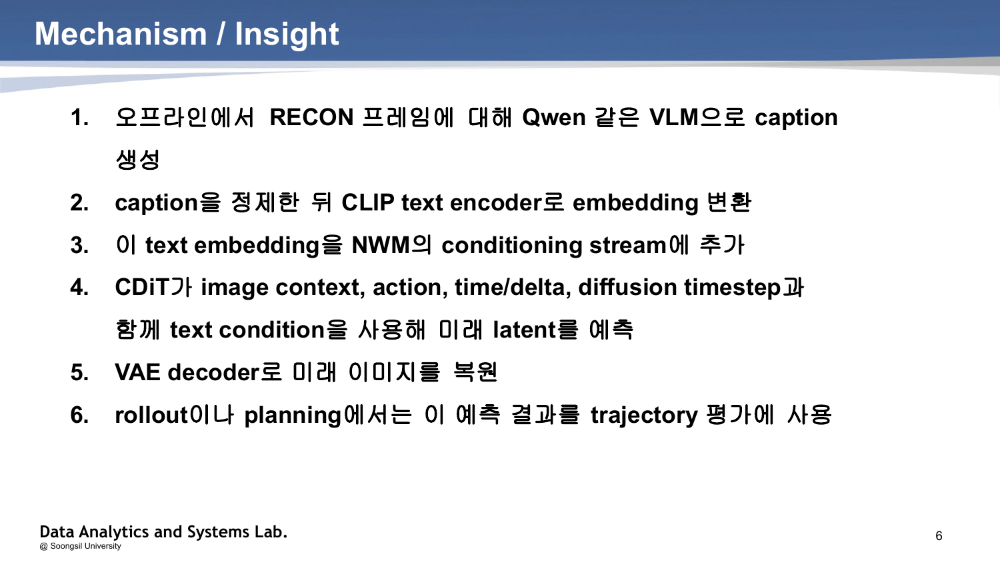
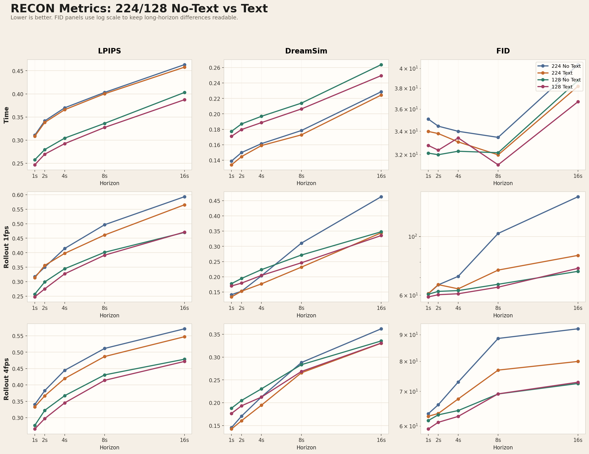

# 1. 주제 (10점)

**저해상도 자율주행/로봇 내비게이션을 위한 Text-Conditioned Lightweight Navigation World Model 설계 제안**

**분반, 팀, 팀장/팀원 이름:** 컴퓨터비전, 곽건

| **2. 요약 (10점)** | **3. 대표 그림 (1개 이상, 10점)** |
|---|---|
| 본 제안서는 저해상도 visual world modeling 환경에서 이미지 정보만으로는 사라지기 쉬운 장면의 semantic 정보를 텍스트 조건으로 보완하는 경량 Navigation World Model(NWM)을 제안한다. 기존 NWM은 과거 이미지, action, time/delta, diffusion timestep을 조건으로 다음 미래 프레임을 생성하지만, 해상도를 낮추거나 긴 rollout을 수행하면 작은 예측 오차가 누적되어 drift와 hallucination이 발생할 수 있다. 제안 방식은 RECON 프레임에 대해 오프라인 VLM caption을 생성하고, 이를 CLIP text embedding으로 변환한 뒤 CDiT conditioning stream에 결합한다. 텍스트는 정책을 직접 결정하는 명령이 아니라 “앞에 열린 길”, “오른쪽 장애물”, “좌측 통로”와 같은 장면 의미를 압축적으로 제공하는 semantic prior로 사용된다. 기대 효과는 저해상도 입력에서도 미래 프레임 예측 품질을 유지하고, 장기 rollout 및 OOD 환경에서 장면 구조 이해를 안정화하는 것이다. | {width=3.1in} 그림 1. Text-conditioned NWM의 핵심 처리 흐름 |

\newpage

# 4. 서론 (1장 이내)

자율주행, 실내 로봇, 무인 탐사 시스템은 현재 관측과 행동 후보를 바탕으로 가까운 미래의 시각 상태를 예측해야 한다. Navigation World Model은 과거 프레임과 상대 이동/회전 action, 시간 정보를 CDiT 기반 diffusion model에 입력해 미래 이미지를 생성하고, rollout 또는 planning 단계에서 trajectory 평가에 활용한다. 이 접근은 실제 환경을 직접 반복 시도하지 않고도 행동 결과를 예측할 수 있다는 장점이 있다.

그러나 기존 방식은 고해상도 이미지와 큰 모델에 의존할수록 추론 비용이 커지고, 경량화를 위해 해상도를 낮추면 길, 장애물, 통로, 벽면 구조와 같은 의미 정보가 쉽게 약화된다. 특히 긴 autoregressive rollout에서는 한 번의 작은 시각 예측 오류가 다음 입력으로 다시 들어가면서 drift와 hallucination으로 확대될 수 있다. 새로운 공간이나 조명, 구조가 다른 OOD 환경에서는 visual context만으로 장면의 안정적인 구조를 파악하기 어렵다.

본 과제의 문제 정의는 다음과 같다. “저해상도 입력을 사용하는 경량 NWM에서 손실되는 semantic 정보를 텍스트 조건으로 보완하면 future frame prediction과 rollout 안정성이 개선되는가?” 이를 해결하기 위해 이미지에서 직접 보이지 않거나 흐릿하게 표현되는 장면 의미를 VLM caption으로 추출하고, 학습 및 추론 시 text embedding을 NWM conditioning에 추가한다. 이 방식은 온라인 VLM 추론을 강제하지 않고 오프라인 caption 및 cached embedding을 사용하므로, 기존 NWM 구조와 계산 흐름을 크게 바꾸지 않으면서 semantic prior를 주입할 수 있다.

# 5. 본론 (1장 이내)

{width=5.7in}

제안 시스템은 `raw RECON frame -> Qwen caption -> caption cleaning -> CLIP text embedding -> dense text cache -> text-conditioned CDiT -> VAE decoding -> rollout/planning evaluation` 순서로 구성된다. 먼저 RECON 데이터의 프레임을 오프라인에서 Qwen2-VL-7B-Instruct와 같은 VLM에 입력해 장면 설명을 생성한다. 생성된 caption은 boilerplate를 제거하고 짧고 명확한 문장으로 정제한다. 정제된 텍스트는 CLIP text encoder를 통해 embedding으로 변환하며, sparse 1fps caption을 trajectory의 dense cache와 정렬해 학습 중 빠르게 로딩할 수 있게 한다.

필요한 기술 요소는 네 가지이다. 첫째, CDiT 기반 diffusion world model은 noisy future state를 image context, action, time/delta, diffusion timestep 조건과 함께 denoising해 미래 latent를 예측한다. 둘째, VAE는 latent future state를 실제 이미지 공간으로 복원한다. 셋째, VLM captioning과 CLIP text embedding은 장면의 semantic 정보를 압축된 벡터로 제공한다. 넷째, LPIPS, DreamSim, FID는 생성 이미지가 GT와 얼마나 유사한지 평가하고, ATE와 RPE는 planning trajectory의 전역/상대 이동 오차를 측정한다.

구현 방법은 기존 NWM의 conditioning vector에 `text_proj`를 추가해 text embedding을 같은 차원의 조건 신호로 합산하는 것이다. 데이터셋 로더는 cached text embedding을 선택적으로 읽고, 학습/추론/evaluation entrypoint는 text input이 있을 때만 이를 모델에 전달한다. 평가에서는 direct time prediction, 4fps autoregressive rollout, 1fps autoregressive rollout을 모두 비교한다. PDF의 실험 결과에 따르면 224 Text 모델과 128 Text 모델은 no-text baseline 대비 LPIPS, DreamSim, FID가 전반적으로 감소하는 경향을 보였고, 학습 step이 증가할수록 세 지표가 함께 하락해 예측 품질이 개선되는 흐름을 확인했다. 향후에는 text prompt의 길이, 위치 정보 포함 여부, 흑백/저해상도 조건, OOD 상황별 실패 사례를 비교해 텍스트 조건의 효과가 발생하는 조건을 더 구체화한다.

\newpage

# 6. 결론

본 제안서는 저해상도 경량 Navigation World Model에서 이미지 정보만으로 부족한 장면 의미를 텍스트 조건으로 보완하는 방법을 제시했다. 핵심은 VLM이 생성한 caption을 CLIP embedding으로 변환해 CDiT conditioning stream에 추가하고, 텍스트를 직접적인 행동 명령이 아니라 미래 프레임 생성을 돕는 semantic prior로 사용하는 것이다. 이를 통해 낮은 해상도에서 사라지는 구조 정보를 보완하고, 장기 rollout의 누적 오류와 OOD 환경의 불안정성을 줄일 수 있다.

향후 할 일은 세 가지이다. 첫째, prompt를 장황한 설명, 짧은 설명, 수치/위치 정보 포함 설명으로 나누어 어떤 텍스트가 성능 개선에 가장 효과적인지 확인한다. 둘째, 이미지 생성 품질 개선이 실제 navigation 성능 향상으로 이어지는지 ATE와 RPE 기반 planning evaluation을 확정한다. 셋째, 텍스트 조건이 오히려 성능을 낮추는 상황을 분석하고, 현재 위치 기반 검색으로 필요한 텍스트 정보를 제공하는 위치 정보 RAG 가능성을 검토한다.

# 7. 출처

[1] Navigation World Model, “Navigation World Models,” CVPR 2025.

[2] Qwen Team, “Qwen2-VL: Enhancing Vision-Language Model's Perception of the World at Any Resolution,” 2024.

[3] Alec Radford et al., “Learning Transferable Visual Models From Natural Language Supervision,” ICML, 2021.

[4] Richard Zhang et al., “The Unreasonable Effectiveness of Deep Features as a Perceptual Metric,” CVPR, 2018.

[5] Stephanie Fu et al., “DreamSim: Learning New Dimensions of Human Visual Similarity using Synthetic Data,” NeurIPS, 2023.

[6] Martin Heusel et al., “GANs Trained by a Two Time-Scale Update Rule Converge to a Local Nash Equilibrium,” NeurIPS, 2017.
